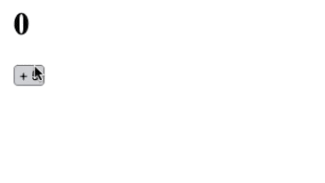
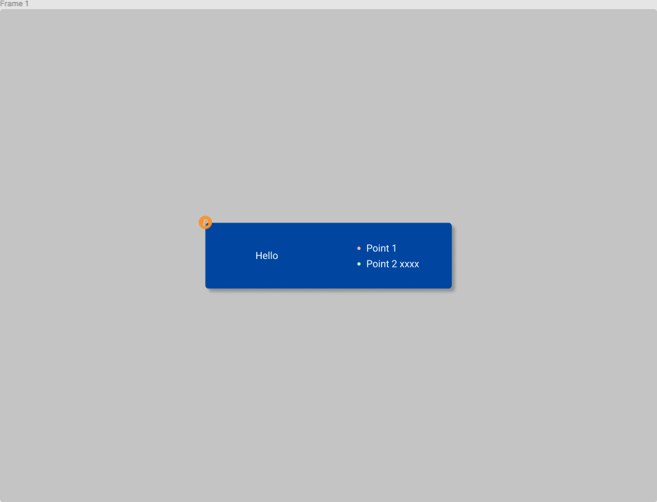

# Crypto-Arsenal 前端實習測試

感謝您應徵 Crypto-Arsenal 的前端實習工程師職位！此儲存庫作為線上測試題目使用，請依照以下步驟進行：

感謝您應徵敝公司的實習前端工程師職缺，此儲存庫作為線上測試題目使用，請參考以下流程。過程中可能需時數分鐘，請同時檢閱下方的需求說明。

1. 將本儲存庫 Clone 至您的開發環境。
2. 建立一個新的 GitHub 私有儲存庫：
   - 前往 https://github.com/new/ ，建立私有儲存庫。
   - 將 twzjwang 設定為協作者
3. 在本地儲存庫設定新的遠端連結：
   - 移除現有遠端： `git remote remove origin`
   - 添加您的儲存庫作為新遠端： `git remote add origin https://github.com/[your-username]/[your-repo].git`
   - 推送所有本地分支： `git push -u origin --all`
4. 開始開發
5. 兩小時內需至少提交一次，請將您的儲存庫連結寄至下列信箱 (若不繼續作答也請在信中告知)：
   - richard@crypto-arsenal.io
   - zanjun@crypto-arsenal.io
6. 兩小時後仍可繼續開發，但完成速度將影響評估，請盡快完成。
7. 完成所有題目後，再次寄送儲存庫連結給我們，歡迎在信件內補充任何說明。

## 注意事項

- 除了 `Git` 題目以外，其他答案請提交至主分支 `main`。
- 請使用清晰的 Git 提交訊息。
- 開發時間計算自開啟測試郵件的時間至最後一次提交，勿試圖篡改提交時間。
- 若遇到非開發問題（包括但不限於網絡問題），請及時告知我們。
- 您可使用 Google、ChatGPT、Stack Overflow 等工具，但面試時須解釋實作原理。
- 您可以升級外部套件，但不可引入全新套件（升級引入的必要套件除外）。

## 題目

請完成以下五個題目，前三題 (`Git`, `Next.js`, `TailwindCSS`) 必須在兩小時內提交：

- Git
- Next.js
- TailwindCSS
- Storybook (加分題)
- Playwright (加分題)

### Git

切換到 `test` 分支並依據 README 完成任務。

### Next.js

建立一個頁面 `/count`，實現以下功能：

1. 點擊 `+5` 按鈕後，數字會以 500 ms 間隔逐漸增加至目標數字。
2. 增加過程中，連續點擊 `+5` 將持續提高目標數字（例如：數字從 0 開始，連點兩次後，2.5 秒內數字將增加至 5，5 秒內增加至 10）。

### TailwindCSS

建立一個頁面 `/visual`，實現以下 Figma 設計：
https://www.figma.com/file/qiDpmzmpE0psEz7HJ12OuS/CSS-Test?node-id=0%3A1

1. 無需實現灰色背景。
2. 藍色區塊需置中顯示。
3. 必須完全使用 TailwindCSS。
4. 比特幣圖標網址： https://i.imgur.com/Uh6IvcO.png
5. 留意設計中的顏色與陰影。

### Storybook

為 `TailwindCSS` 部分實現的元件建立一個 Story，並確認其在 Storybook 中正常顯示。
Story 文件應位於 `app/**/*.stories.tsx`。

### Playwright

為 Next.js 頁面 `/count` 寫一個 E2E 測試，確保頁面功能正常運行。
